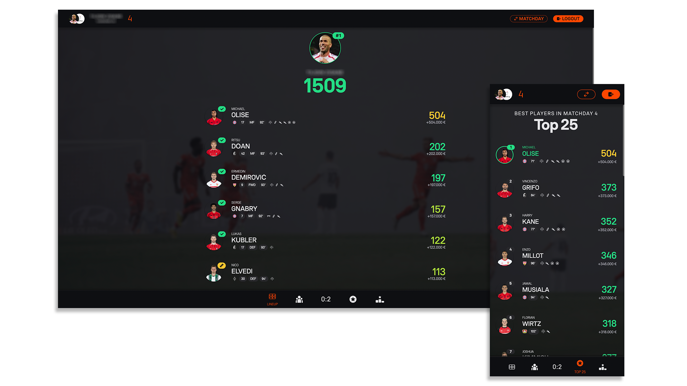

<p align="center">
    
</p>

<h1 align="center">
Kickbase Live
</h1>

<p align="center"><strong>Kickbase Live is an alternative web client for viewing matchday performances.</strong></p>

<div align="center">

<a href="https://kickbase-live.web.app/">


</a>


<a href="https://buymeacoffee.com/simonsagstd">


</a>

</div>

<small>

> **Note:** This is a hobby project and was used for educational purposes to exercise and improve my skills while attending a reactjs training. I am not associated with Kickbase in any relation or responsible for the data provided by their API. I am not storing or analyzing any information/data within or outside the app. All data is stored inside your browsers local storage or indexed db.

## Summary

</small>

Kickbase Live is an alternative web client for **viewing performances of all matchdays**. It uses the **official Kickbase API v4** to retrieve the necessary data. The look is inspired by Kickbase and combines the Kickbase v3 layout with some of the new Kickbase v4 design patterns.

## Table of Contents

-   [Features](#features)
-   [Demo](#demo)
-   [Setup](#setup)
-   [Contributing](#contributing)
-   [License](#license)

## Features

-   Switch between your leagues
-   View past and running matchdays
-   Squad performance (your own and all other league manager)
-   Matchday results
-   Team players performance (specific match or all time)
-   Manager ranking
-   Team ranking
-   Top 25
-   Competition Leaderboard
-   Install as a progressive web app for mobile or desktop

## Demo

You can test this app with a demo I deployed on firebase hosting: https://kickbase-live.web.app/

> **Important information:**

> I am not storing your credentials. After the login the app makes a request to the offical Kickbase API to authenticate your account with their services. The app will receive an access token which will be stored locally in your browser. You can delete any data by logging out or deleting the application storage in the application tab within your browsers developer tools. The access token is valid for 7 days and you will be automatically logged out after it expires.

> <small>The demo website should be only used for testing or demonstration purposes. This way you dont have to donwload the source code and you can have an initial look at the application. It uses a free hosting tier on firebase which is limited to 360MB traffic per day. So it might happen that website is not available when the limit is exceeded. If you want to fully benefit from this project you have to host it yourself or download and run it locally.</small>

## Setup

_Tested with Node v20.9.0_

Clone the repository

```bash
git clone https://github.com/simonsagstetter/kickbaselive.git
```

Navigate to project directory

```bash
cd kickbaselive/
```

Install all dependencies

```bash
npm install
```

For development

```bash
npm run dev
  ➜  Local:   http://localhost:5173/
  ➜  Network: http://0.0.0.0:5173/
  ➜  press h + enter to show help
```

Generate a production build

```bash
npm run build
```

Preview and test a production build

```bash
npm run preview
  ➜  Local:   http://localhost:4173/
  ➜  Network: http://0.0.0.0:4173/
  ➜  press h + enter to show help
```

### API

Im using the Kickbase v4 Endpoints which I have documented in my [Kickbase API v4 Docs](https://github.com/simonsagstetter/kickbase-api-v4-docs).

## Contributing

Contributions are welcome! Please see into [CONTRIBUTING.md](https://github.com/simonsagstetter/kickbaselive/blob/main/CONTRIBUTING.md) for details on the code of conduct and submission process.

### Roadmap

-   Player details
    -   Season perfomance and stats
    -   Market value insights
    -   A performance evaluation algorithm
    -   Player event history for the currently active matchday
-   Show match events and announced team lineup when clicking on the score within "standings" tab

### Contributors

<!-- ALL-CONTRIBUTORS-LIST:START - Do not remove or modify this section -->
<!-- prettier-ignore-start -->
<!-- markdownlint-disable -->
<table>
  <tbody>
    <tr>
      <td align="center" style="border: 1px solid transparent"><a href="https://github.com/simonsagstetter"><br /><sub><b>simonsagstetter</b></sub></a></td>
    </tr>
  </tbody>
</table>

<!-- markdownlint-restore -->
<!-- prettier-ignore-end -->

<!-- ALL-CONTRIBUTORS-LIST:END -->

## License

This project is licensed under the MIT License - see the [LICENSE](LICENSE) file for details
